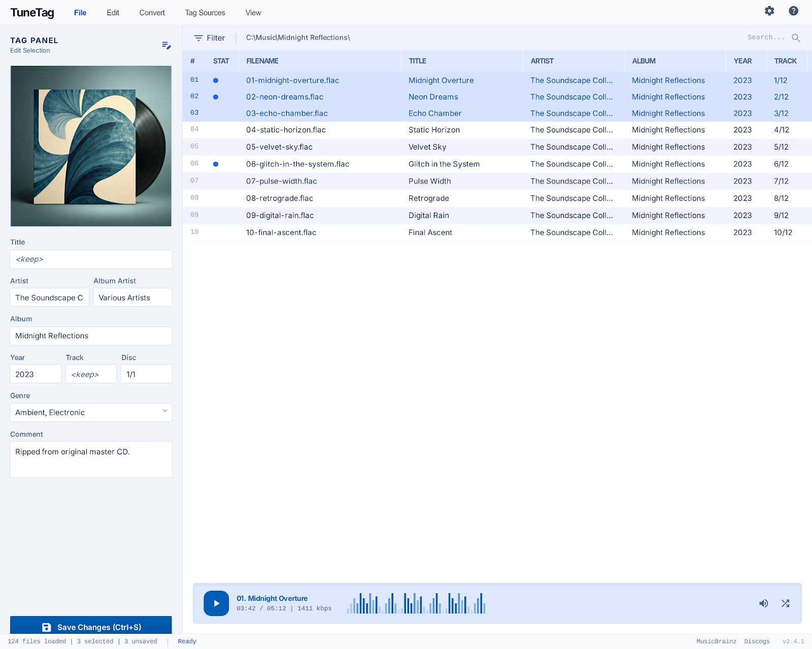

# TuneTag

Cross-platform desktop audio tag editor for macOS, Linux, and Windows. A modern alternative to [Mp3tag](https://www.mp3tag.de/) — with a GUI built on Tauri v2 and a CLI for scripting.


*Design mockup — not all features are implemented yet.*

## Features (v1 scope)

- **Tag editing** — Title, Artist, Album, Album Artist, Year, Track, Disc, Genre, Comment
- **Multi-file editing** — Select multiple files, edit shared fields, `<keep>` differing values
- **Cover art** — View, embed (drag-and-drop), remove, export
- **Rename from tags** — Format strings like `%artist% - %title%` with live preview and collision detection
- **Auto-number tracks** — Batch assign track/disc numbers with preview
- **MusicBrainz lookup** — Search, browse releases, apply metadata with field-level diff
- **ID3 version preservation** — v2.3 stays v2.3, v2.4 stays v2.4 (opt-in force upgrade)
- **CLI** — Headless binary for scripting and automation

## Supported Formats

| Format | Tag Standard | Read | Write |
|--------|-------------|------|-------|
| MP3 | ID3v2 (v2.3 and v2.4) | Yes | Yes |
| FLAC | Vorbis Comments | Yes | Yes |
| M4A/AAC | MP4 atoms (iTunes tags) | Yes | Yes |

## Architecture

```
┌─────────────────────────────────┐
│  tunetag-core (Rust library)    │  Tag I/O via lofty, audio properties,
│  crates/tunetag-core/           │  rename logic, shared utilities
├────────────────┬────────────────┤
│  tunetag-gui   │  tunetag-cli   │
│  Tauri v2 app  │  CLI binary    │
│  React + TS    │  clap          │
│  crates/       │  crates/       │
│  tunetag-gui/  │  tunetag-cli/  │
└────────────────┴────────────────┘
```

Both the GUI and CLI link against the same `tunetag-core` crate — tag reading, writing, and audio property logic is implemented once.

**Tech stack:**
- **Backend:** Rust, [Tauri v2](https://v2.tauri.app/), [lofty-rs](https://github.com/Serial-ATA/lofty-rs) (tag I/O)
- **Frontend:** React 19, TypeScript, Vite 7, Tailwind CSS 4
- **CLI:** [clap](https://github.com/clap-rs/clap) (derive API)

## Development Setup

### Prerequisites

- [Rust](https://rustup.rs/) (1.75+)
- [Node.js](https://nodejs.org/) (22+)
- Platform-specific Tauri dependencies:

**Fedora/RHEL:**
```bash
sudo dnf install webkit2gtk4.1-devel gtk3-devel libappindicator-gtk3-devel librsvg2-devel libsoup3-devel pango-devel
```

**Ubuntu/Debian:**
```bash
sudo apt install libwebkit2gtk-4.1-dev libgtk-3-dev libappindicator3-dev librsvg2-dev libsoup-3.0-dev patchelf
```

**macOS:** Xcode Command Line Tools (`xcode-select --install`)

**Windows:** [WebView2](https://developer.microsoft.com/en-us/microsoft-edge/webview2/) (usually pre-installed on Windows 10+)

### Build

```bash
# Clone
git clone https://github.com/mgrabowski84/tunetag.git
cd tunetag

# Install frontend dependencies
cd crates/tunetag-gui && npm install && cd ../..

# Build everything
cargo build --workspace

# Run the GUI (dev mode with hot reload)
cd crates/tunetag-gui && npx tauri dev

# Run the CLI
cargo run -p tunetag-cli -- --help

# Run tests
cargo test --workspace
```

## CLI Usage

```bash
# Read all tags
tunetag read track.mp3

# Set artist and title
tunetag write track.mp3 --artist "Radiohead" --title "Creep"

# Preview tag writes without committing
tunetag write track.mp3 --artist "Radiohead" --dry-run

# Bulk rename from tags
tunetag rename ~/Music/*.mp3 --format "%track% - %title%"

# Preview renames without committing
tunetag rename ~/Music/*.mp3 --format "%artist% - %title%" --dry-run

# Embed cover art
tunetag cover set track.mp3 --image cover.jpg

# Remove cover art
tunetag cover remove track.mp3

# Print audio properties
tunetag info track.flac

# Auto-number tracks
tunetag autonumber ~/Music/album/*.mp3 --start 1 --total 12 --disc 1

# JSON output for scripting
tunetag read track.mp3 --json
```

## Project Status

TuneTag is in active development. Here's what's implemented and what's planned:

| Component | Status |
|-----------|--------|
| Rust workspace + CI | Done |
| Core tag I/O (read/write/cover art) | Done |
| Audio properties | Done |
| GUI app shell (layout, menu, tag panel) | Done |
| CLI scaffold (argument parsing) | Done |
| File loading + file list | Planned |
| Tag panel editing + save | Planned |
| Undo/redo | Planned |
| Rename from tags | Planned |
| Auto-numbering | Planned |
| MusicBrainz lookup | Planned |
| CLI subcommand implementation | Planned |
| Keyboard navigation | Planned |

Development is tracked with [OpenSpec](https://github.com/Fission-AI/OpenSpec) — see `openspec/changes/` for detailed proposals, designs, specs, and task lists for each feature.

## License

MIT
